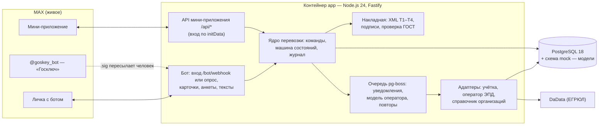

# Накладная в кармане

Бот и мини-приложение в MAX, которые ведут электронную транспортную накладную (ЭТрН) одной перевозки: от отгрузки
в учётной системе до подписанного четвёртого титула. Каждый шаг бот доводит до конкретного человека в его личной переписке:
диспетчера отправителя, диспетчера перевозчика, водителя и получателя без своего ЭДО.

Хакатон MAX 2026, трек «Эффективный бизнес», команда 397 «Технологии Интеллекта».

| Что | Где |
|---|---|
| Бот в MAX | [max.ru/t397_hakaton_max_bot](https://max.ru/t397_hakaton_max_bot) — «Хакатон МАХ 397» |
| Мини-приложение | кнопка «Открыть» в чате с ботом; адрес `https://hakaton.salam0nn.ru/app` (работает только внутри MAX) |
| Проверка, что сервер жив | [hakaton.salam0nn.ru/healthz](https://hakaton.salam0nn.ru/healthz) |
| Где работает стенд | российский сервер (152-ФЗ), с 29.09.2026 |
| Версия на сдачу | тег `online-2026-09-30-final` — на стенде работает этот же код |

**Что живое, а что модель** — коротко (подробно в разделе 6). Живое: MAX целиком (бот, кнопки, контакты, файлы,
мини-приложение), подпись через «Госключ» с проверкой ГОСТ, XML титулов по формату ФНС, справочник организаций через DaData,
машиночитаемые доверенности подписантов (кроме сверки с реестром ФНС).
Модель: учётная система, оператор ЭПД и ГИС ЭПД (номер накладной, регистрация, QR-код), подпись организации
(демо-удостоверяющий центр), демо-организации. Все компании, люди и отгрузки в демо-данных вымышлены. В интерфейсе
смоделированные части помечены словом «модель».

## Быстрый старт

```bash
cp .env.example .env   # можно не заполнять: по умолчанию MAX_MODE=off
docker compose up --build
curl http://localhost:3000/healthz
```

Без токена бота (`MAX_MODE=off`) поднимаются база, сервер и сборка мини-приложения, но бот не подключается к MAX,
а API мини-приложения выключен: по адресу `/app/` будет экран «Откройте из MAX». Сам сценарий проверяется в MAX —
на живом боте (раздел 8) или на своём тестовом боте (раздел 4).

## 1. Назначение решения

С 1 сентября 2026 года перевозочные документы при автоперевозках оформляются только в электронном виде (140-ФЗ).
Накладная — это четыре титула, которые по очереди подписывают три разные организации: отправитель (Т1),
перевозчик при погрузке (Т2), получатель (Т3) и перевозчик при сдаче груза (Т4). Операторы ЭДО решили,
как документ доходит до государственной системы. Но никто не решил, как он доходит до человека. Водителю ставят
отдельное приложение с паролем. Получателю без своего ЭДО нужен кабинет у оператора. О том, что сейчас его очередь,
человек узнаёт звонком.

«Накладная в кармане» переносит этот путь в мессенджер, который уже есть у всех участников:

- **отправитель** выбирает отгрузку из учётной системы, назначает перевозчика и подписывает свой титул;
- **перевозчик** входит по ссылке-приглашению, назначает машину и водителя, подписывает приём и сдачу груза;
- **водитель** ничего не устанавливает и не регистрируется: принимает рейс, отмечает погрузку и выгрузку, получает QR-код накладной;
- **получатель** открывает ссылку, отмечает приёмку (с расхождениями или без) и подписывает бесплатной подписью «Госключа».

Бот сам пишет тому, чья сейчас очередь, и держит у каждого участника одну «живую» карточку перевозки.
Мини-приложение показывает те же перевозки списками с фильтрами, карточкой, документами и лентой событий.

Для кого: производственные и торговые компании с собственной отгрузкой автотранспортом, их наёмные перевозчики
и получатели без своего ЭДО. Пример в демо — завод моторных масел в Елабуге и получатели в Татарстане и соседних регионах.

## 2. Основной пользовательский сценарий

Одна перевозка — ОТГ-2026-1040 демо-завода — проходит через четыре роли:

1. **Отправитель** подключает компанию по ИНН, открывает список отгрузок из учётной системы (модель) и выбирает отгрузку.
2. **Отправитель** назначает перевозчика: пересылает боту его контакт MAX. Если перевозчик ещё не в боте, бот даёт ссылку-приглашение.
3. **Перевозчик** входит по ссылке, сразу видит груз и маршрут, принимает заявку и назначает машину и водителя (или «Я сам за рулём»).
4. **Водитель** принимает рейс, отмечает прибытие и подтверждает погрузку: «Всё верно» или «Есть замечания».
5. **Отправитель** подписывает накладную (Т1): «Госключ» или демо-подпись организации (модель).
6. **Перевозчик** подписывает приём груза (Т2). Оператор ЭПД (модель) регистрирует накладную, водитель получает QR-код картинкой в чат, отправитель — ссылку для получателя.
7. **Водитель** отмечает выгрузку и сдачу груза.
8. **Получатель** открывает ссылку, отмечает приёмку («без расхождений», «частично» или «отказ») и подписывает Т3.
9. **Перевозчик** подписывает Т4 — накладная закрыта, все получают итог, статус уходит в учётную систему (модель).

Каждый шаг — одна-две кнопки. Бот пишет следующему участнику «сейчас ваш ход», у остальных обновляет карточку.

## 3. Состав и архитектура решения



| Часть | Где | Что делает |
|---|---|---|
| `apps/app` | контейнер `app` | приём обновлений MAX (вебхук или опрос), бот, API мини-приложения, ядро перевозки, адаптеры, очередь заданий (pg-boss); отдаёт сборку мини-приложения по `/app` |
| `apps/miniapp` | собирается в образ `app` | мини-приложение на React и MAX UI: списки по ролям, карточка перевозки, документы, лента, формы приёмки, машины и водители |
| `packages/domain` | библиотека | контракты, машина состояний Т1–Т4, правила «чей ход», проверка ИНН — без базы и сети |
| `packages/etrn` | библиотека | XML титулов Т1–Т4 по формату ФНС 5.01, демо-УЦ, проверка подписи «Госключа» (openssl с ГОСТ-движком) |
| PostgreSQL 18 | контейнер `postgres` | перевозки, участники, титулы, подписи, журнал событий, входящие обновления; схема `mock` — модели внешних систем |

Ключевые решения:

- **Ядро не знает про MAX и внешние системы.** Учётная система, оператор ЭПД и справочник спрятаны за интерфейсами `ErpAdapter`, `EpdOperator`, `OrgDirectory` (`packages/domain/src/ports.ts`). На хакатоне за ними модели на таблицах; настоящая реализация подключается без правки ядра.
- **Каждое действие — команда ядра** в транзакции с блокировкой перевозки и проверкой состояния: двойное нажатие не создаёт второго перехода.
- **Входящие обновления MAX** записываются в таблицу `inbox` с дедупликацией; повторная доставка не выполняется дважды.
- **Исходящие сообщения** идут через очередь с ограничением частоты под лимиты MAX и повторами при сбоях.
- **Бот и мини-приложение рисуют одно и то же состояние** перевозки: одни и те же статусы и «чей ход».

Адреса сервера: `/healthz` — проверка; `/bot/webhook` — вебхук MAX (только в режиме `webhook`); `/app` — мини-приложение;
`/api/*` — внутренний бэкенд мини-приложения.

**Собственного публичного API нет.** `/api/*` — внутренний бэкенд мини-приложения: вход только через подписанный
MAX `initData` (проверка HMAC-SHA256 по алгоритму MAX, срок 1 час), дальше сессия на 8 часов; каждая организация
видит только свои перевозки.

## 4. Запуск одной командой

```bash
cp .env.example .env
docker compose up --build        # база + приложение; сборка из чистого клона — около минуты
```

Что получится: `http://localhost:3000/healthz` отвечает `{"ok":true,...}`, при первом запуске применяются миграции
и загружаются демо-данные (17 отгрузок демо-завода).

**Со своим тестовым ботом.** Чтобы пройти сценарий на локальной копии, нужен свой бот в MAX:

```bash
# в .env
MAX_MODE=polling
MAX_BOT_TOKEN=<токен СВОЕГО тестового бота>
docker compose up --build
```

> Не запускайте локальную копию с токеном бота команды из презентации: опрос с чужого сервера будет забирать
> сообщения у живого бота. Для проверки основного сценария пользуйтесь живым ботом (раздел 8).

Мини-приложение на локальной копии открывается только внутри MAX, поэтому для него нужен публичный HTTPS-адрес,
привязанный к боту в кабинете MAX для бизнеса.

## 5. Параметры окружения, порты, зависимости

| Переменная | Обязательна | Что это |
|---|---|---|
| `MAX_MODE` | нет, по умолчанию `off` | `off` — без MAX; `polling` — опрос `GET /updates` (для отладки); `webhook` — боевой режим с подпиской `POST /subscriptions` |
| `MAX_BOT_TOKEN` | при `polling` и `webhook` | токен бота из кабинета MAX для бизнеса; без него API мини-приложения не поднимается |
| `MAX_WEBHOOK_SECRET` | при `webhook` | секрет, который MAX присылает в заголовке `X-Max-Bot-Api-Secret` |
| `PUBLIC_URL` | при `webhook` | публичный HTTPS-адрес сервера; вебхук — `<PUBLIC_URL>/bot/webhook` |
| `DADATA_API_KEY` | нет | справочник организаций по ЕГРЮЛ; без ключа находятся только демо-организации, остальные вводятся вручную с пометкой «не проверено» |
| `POSTGRES_USER`, `POSTGRES_PASSWORD`, `POSTGRES_DB` | нет | учётные данные базы в compose; `DATABASE_URL` собирается сам |
| `APP_PORT` | нет, `3000` | порт приложения на хосте |
| `LOG_LEVEL` | нет, `info` | уровень журнала |

Значения для проверки — на служебном слайде презентации; в репозитории секретов нет (`.env` в `.gitignore`).

Порты: `3000` — приложение (`APP_PORT` на хосте); PostgreSQL наружу не публикуется.

Зависимости: Node.js 24 LTS, PostgreSQL 18; точные версии пакетов — `package-lock.json` (npm workspaces).
Образ собирается на `node:24-bookworm-slim` с пакетом `libengine-gost-openssl` (ГОСТ для подписей) и корневым
сертификатом Минцифры (нужен для `platform-api2.max.ru`).

## 6. Внешние сервисы и интеграции

| Сервис | Живое или модель | Как работает | Как проверить |
|---|---|---|---|
| MAX Bot API | живое | сообщения, кнопки, живые карточки через `PUT /messages`, файлы, контакты; вебхук или опрос | живой бот, раздел 8 |
| Мини-приложение MAX (Bridge) | живое | вход по `initData`, яркость экрана для QR, скачивание файлов | внутри MAX, кнопка «Открыть» |
| Подтверждённый номер | живое | кнопка «Поделиться номером», сервер сверяет подпись MAX (HMAC-SHA256 от `vcf_info`) | первая отметка или подпись |
| «Госключ» | живое | бот присылает XML титула, человек подписывает его в @goskey_bot и пересылает `.sig` боту; проверяются ГОСТ-подпись над нашим XML, цепочка до корня «Госключа», список отзыва с goskey.ru, срок сертификата, время подписи, ИНН | нужен свой «Госключ» с неквалифицированной подписью (УНЭП); без него — демо-подпись |
| DaData (ЕГРЮЛ) | живое | реквизиты по ИНН, статус ликвидации; ответы кэшируются (найдено — неделю, не найдено — сутки) | ввести реальный ИНН при подключении |
| Учётная система | **модель** | таблицы `mock.erp_*`: 17 отгрузок из сида, даты от дня запуска, загрузка новых отгрузок из Excel, обратная запись статуса после закрытия | «Отгрузки», «Загрузить из Excel» |
| Оператор ЭПД и ГИС ЭПД | **модель** | таблицы `mock.epd_*`: принимает титулы, проверяет порядок и сцепку подписей, выдаёт номер, «регистрирует» накладную и QR-код (анимированный GIF, внутри пометка `model:true`) | после подписи Т2 |
| Подпись организации | **модель** | демо-УЦ «Накладная в кармане» (модель): настоящая ГОСТ-подпись, но доверенный корень — только наш | кнопка «Демо-подпись (модель)» |
| Машиночитаемая доверенность (МЧД) | живое, кроме реестра | сотрудник подписывает за компанию только по действующей МЧД, руководитель и ИП — без неё. Файл МЧД формата 003 разбирается и проверяется: формат, сроки, доверитель — эта компания, представитель — этот человек, подпись руководителя (ГОСТ, цепочка до корня Минцифры, отзыв). Номер и дата выдачи пишутся в титул (`СвДовер`). **Статус в реестре ФНС — не проверяется**: `m4d.nalog.gov.ru` недоступен с сервера | анкета роли → «Я сотрудник, по доверенности» → прислать файл МЧД или номер и даты |
| Справочник организаций | демо-данные + DaData | 24 вымышленные организации из сида находятся без ключа | ИНН из раздела 7 |

Для реальной работы вместо моделей нужны: договор и API аккредитованного оператора ЭПД, подключение учётной системы
(1С или МойСклад) и машиночитаемые доверенности подписантов из реестра ФНС.

## 7. Работа с данными и тестовые данные

Все данные вымышлены.

- `seed/plant-seed.json` — демо-завод моторных масел: организации, машины, водители, 17 отгрузок. Загружается в модели при первом запуске; даты отгрузок сдвигаются от дня загрузки.
- `seed/otgruzki-zavod.xlsx` — таблица новых отгрузок того же завода (17 отгрузок, номера ОТГ-2026-2040…2057) для проверки загрузки из Excel: «Отгрузки» → «Загрузить из Excel» → прислать файл боту.
- `seed/otgruzki-s-oshibkami.xlsx` — та же таблица с пятью типичными ошибками: бот перечисляет их по строкам и ничего не загружает.
- Обе таблицы пересобираются из сида: `npm run seed:xlsx -w @nk/app`.

Демо-ИНН для проверки:

| Роль | Организация | ИНН |
|---|---|---|
| Отправитель | ООО «Волжский завод моторных масел» | `9782242514` |
| Перевозчик | ООО «ГрузЛайн-Казань» | `3603931407` |
| Перевозчик | ООО «Челны-Транс» | `8390825665` |
| Перевозчик | ИП Хабибуллин Р. Ф. | `165595589478` |

Получатель ИНН не вводит: он входит по ссылке из перевозки.

Что хранится о людях: идентификатор и имя из профиля MAX, подтверждённый номер телефона (для доказательства простой
подписи), роли и организации. Сброс демо-данных: `docker compose down -v && docker compose up -d`
(при локальной разработке — `npm run db:reset`).

## 8. Пошаговый сценарий проверки

Нужны два аккаунта MAX (или два человека): первый — отправитель и получатель, второй — перевозчик и водитель.
Бот — [max.ru/t397_hakaton_max_bot](https://max.ru/t397_hakaton_max_bot), кнопка «Начать».

| № | Кто | Что нажать | Что должно произойти |
|---|---|---|---|
| 1 | Отправитель | «Начать» → «+ Отправитель» → ИНН `9782242514` → «Да, это мы» → доверенность (номер и дата или «Укажу позже») → «Подключить» учётную систему | «Готово: роль «отправитель» добавлена». В меню — «Отгрузки» |
| 2 | Отправитель | «Отгрузки» → отгрузка с получателем, которого ещё никто не принимал (такой получатель подставляется сам) | Карточка: откуда, куда, груз (места, масса) и подсказка «Назначьте перевозчика» |
| 3 | Отправитель | «Назначить перевозчика» → скрепка → «Контакт» → контакт второго аккаунта | Если человек ещё не в боте — бот даёт ссылку-приглашение. **Сразу перешлите её перевозчику** |
| 4 | Перевозчик | открыть ссылку → ИНН `3603931407` (или другой перевозчик из раздела 7) → «Да, это мы» → «Принять заявку» | Бот один раз попросит «Поделиться номером» и ответит «Заявка принята»; отправителю придёт уведомление |
| 5 | Перевозчик | «Назначить машину и водителя» → «+ Новая машина» (госномер, марка, кузов, тонны, м³, владение) → «Я сам за рулём» | Водителю (тот же аккаунт) приходит рейс с кнопками «Принять рейс» и «Отказаться от рейса» |
| 6 | Водитель | «Принять рейс» → «Я на погрузке» → «Всё верно, груз принят» | Отправителю — «Водитель принял груз без замечаний. Подпишите накладную» |
| 7 | Отправитель | «Подписать накладную» → «Демо-подпись (модель)» (или «Госключ») | «Накладная подписана», дальше очередь перевозчика |
| 8 | Перевозчик | «Подписать накладную» → «Демо-подпись (модель)» | Через несколько секунд водителю приходит QR-код накладной картинкой, отправителю — ссылка для получателя |
| 9 | Водитель | «Я на выгрузке» → «Груз сдан» | Отправитель пересылает ссылку получателю — в нашем случае открывает её сам |
| 10 | Получатель | открыть ссылку → «Принято без расхождений» → «Подписать накладную» → «Демо-подпись» (номер бот спросит, только если его ещё не подтверждали) | «Накладная подписана», перевозчику — просьба подписать последним |
| 11 | Перевозчик | «Подписать накладную» → «Демо-подпись» | Всем: «Накладная закрыта: груз сдан, все четыре подписи на месте» |

Мини-приложение: кнопка «Открыть» в чате с ботом. Те же перевозки списками («Ждут меня», «В работе», «Закрытые»),
карточка со вкладками «Сводка», «Груз», «Документы», «Лента»; принять заявку, назначить машину и водителя, отметить
погрузку, выгрузку и приёмку по позициям можно прямо там. Кнопки подписи переводят в чат с ботом.

Подпись «Госключом» вместо демо: «Открыть «Госключ» в MAX» → подписать присланный XML **неквалифицированной
подписью (УНЭП)** → переслать ответ «Госключа» с файлом `.sig` боту. Бот проверит подпись и покажет результат.

## 9. Примеры ожидаемого поведения

- **Замечания на погрузке.** Водитель жмёт «Есть замечания» и описывает недостачу — отправитель видит замечание до подписи, в Т1 груз «принят с замечаниями», текст попадает в Т2.
- **Частичная приёмка и отказ.** Получатель указывает расхождения — они попадают в Т3, перевозка доходит до закрытия.
- **ИНН не найден.** Бот предлагает ввести реквизиты вручную и помечает их «не проверено».
- **Неверный ИНН.** «Такого ИНН не бывает» — проверка контрольной цифры.
- **Просроченная ссылка.** «Срок приглашения истёк» → «Попросить новую ссылку» → пригласивший выдаёт новую одной кнопкой.
- **Повторное нажатие** кнопки уже сделанного шага — «Уже сделано», второго перехода нет.
- **Отказ перевозчика или водителя, отмена перевозки отправителем до подписи.** Бот спрашивает причину и сообщает остальным.
- **Чужая перевозка.** Бот и мини-приложение показывают только перевозки своей организации; старая кнопка чужой перевозки — «Вы не участник этой перевозки».
- **Поддельный файл подписи** — «Подпись не прошла проверку» с причиной.
- **Мини-приложение обновляется само:** когда водитель отметил погрузку, у отправителя через несколько секунд появляется уведомление и новая строка.

## 10. Известные ограничения

- **Модели вместо внешних систем:** учётная система, оператор ЭПД и ГИС ЭПД (номер, регистрация, QR-код), подпись организации (демо-УЦ). QR-код накладной — модель: инспектор его не прочитает.
- **Мы не оператор ЭПД.** В реальной работе титул получателя без своего ЭДО пойдёт через аккредитованного оператора (интеграция по API или партнёрство).
- **МЧД не сверяется с реестром ФНС:** зарегистрирована ли доверенность и не отозвана ли, узнать с нашего сервера нельзя (`m4d.nalog.gov.ru` недоступен). Всё остальное в файле МЧД проверяется; для реестра заложен порт `PoaRegistry`. Коды статуса подписанта в титуле (`СтатПодп`: 1 — руководитель, 2 — по доверенности) взяты по правилу схемы и требуют сверки с приказом ФНС о формате ЭТрН. Полномочия в МЧД узнаются по словам, а не по классификатору ФНС.
- **XML** соответствует официальным XSD ФНС (проверяется в тестах, а не перед каждой подписью). Форматно-логический контроль ФНС Т1 пока не проходит: нет ИНН или удостоверения водителя и реквизитов отправителя там, где стоит «совпадает с отправителем». Имя файла упрощено.
- **ФИО подписанта** берётся из профиля MAX, а не из сертификата.
- **«Госключ»:** принимается неквалифицированная подпись (УНЭП); квалифицированная подпись физлица отклоняется по ИНН.
- **Простая подпись в MAX** (отметки водителя и получателя) — доказательство нажатия: аккаунт, подтверждённый номер, время. В XML титула и оператору она не уходит.
- **Нет напоминаний и эскалаций** по висящим шагам и нет сводки «несколько перевозок ждут» — есть очередь «Ждут меня».
- **Перевозчик назначается пересылкой контакта**, не по ИНН. Ссылку-приглашение пересылайте сразу: она показывается в карточке и после «Обновить» не выдаётся повторно.
- **Нужны два аккаунта MAX**: свой контакт переслать нельзя.
- **Получатель одной компании** получает следующие перевозки этой компании автоматически; получатель другой компании по той же ссылке не войдёт.
- **Даты демо-отгрузок** сдвигаются от дня загрузки базы, а не от сегодняшнего дня.
- **Нет PDF** для чтения — только XML титулов и подписи.
- **Мини-приложение** работает только внутри MAX. В веб-версии MAX не скачиваются файлы (метод MAX Bridge `downloadFile` в браузере не работает); при потере сети список показывает «пусто».
- **Бот не открывает мини-приложение из карточки** — только кнопкой «Открыть» в чате с ботом.
- **Сбои модели оператора** включаются только правкой строки в `mock.epd_settings`; демо-пульта нет.

## 11. Остановка и повторный запуск

```bash
docker compose down        # остановить, данные сохраняются в томе pgdata
docker compose down -v     # остановить и стереть базу
docker compose up -d       # запустить снова
```

## 12. Тесты

```bash
npm ci
npm run typecheck
npx vitest run             # без базы часть тестов пропускается
```

Полный прогон — с отдельной базой (тесты её **стирают**) и openssl с ГОСТ-движком, как в образе:

```bash
docker run -d --name nk-test-pg -e POSTGRES_USER=t -e POSTGRES_PASSWORD=t -e POSTGRES_DB=t -p 127.0.0.1:55498:5432 postgres:18-alpine
TEST_DATABASE_URL=postgres://t:t@127.0.0.1:55498/t npx vitest run
```

Если в системном openssl нет ГОСТ-движка, прогон можно выполнить в образе `docker build --target base .`.
Тест настоящей подписи «Госключа» включается файлами `GOSKEY_SAMPLE_*`, их в репозитории нет.

## Лицензия

MIT, см. `LICENSE`.
